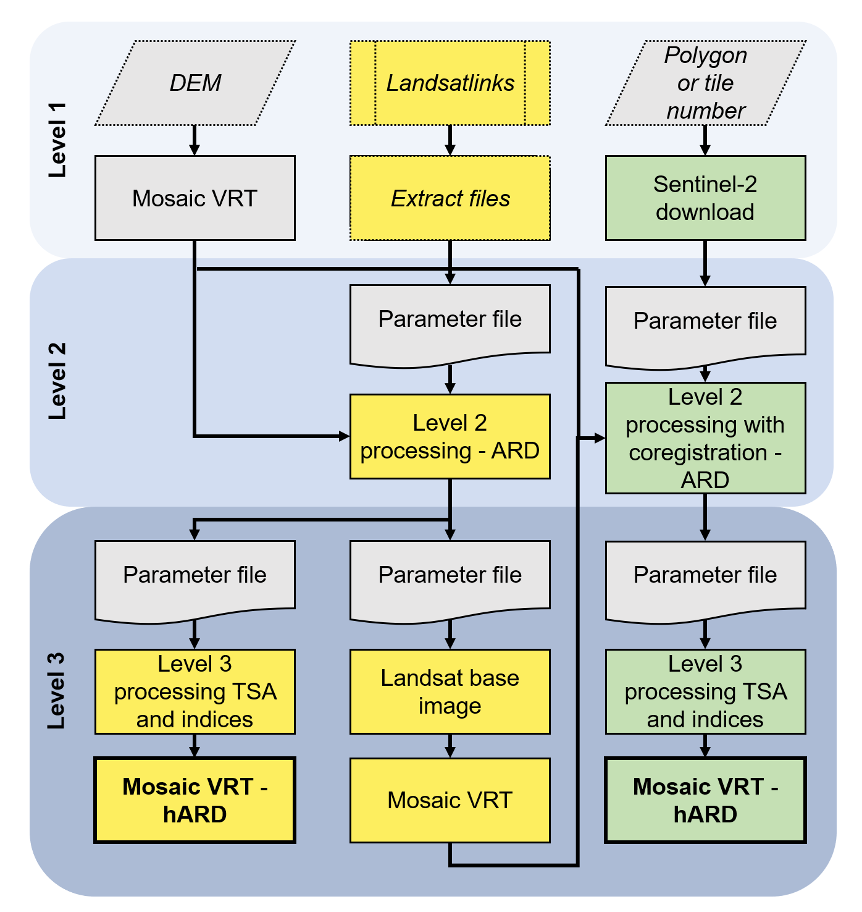

Image: Lisa Bald

# Understanding the levels

To breakdown this complex workflow, we will go through each level and understand different parts of them.

# Level 1

Level 1 deals with input data. The boxes shown with a dotted line indicate the data while solid line indicates the process. At level 2, we get our Analysis Ready Data (ARD).
The parameter files instruct FORCE what kind of processing needs to be performed.

# Level 2 

In level 2, we are using FORCE to process our downloaded input data to be fed into level 3.

# Level 3

In level 3, we use the processed data to generate higher Analysis Ready Data (hARD).
